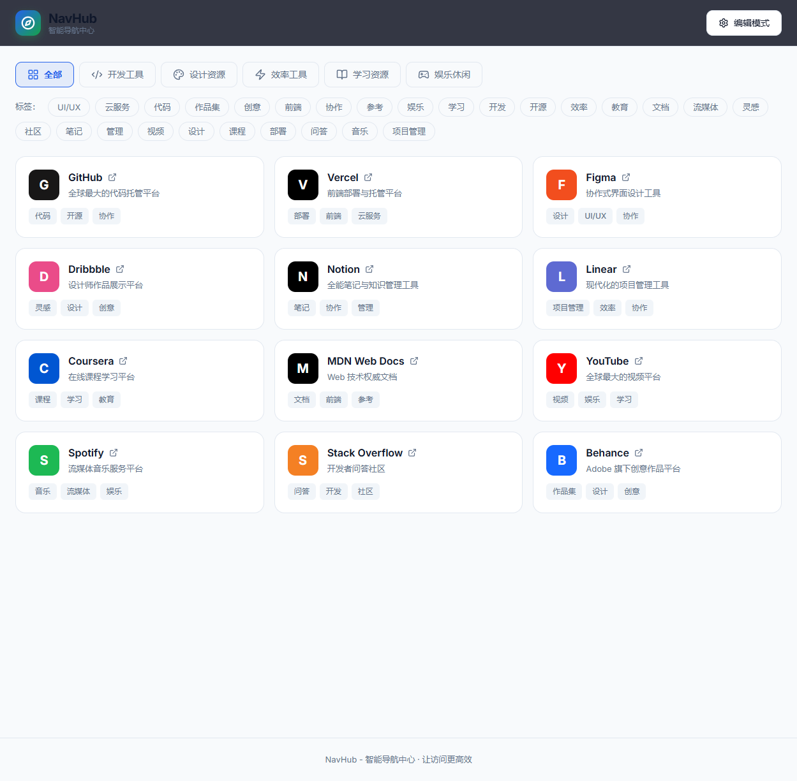
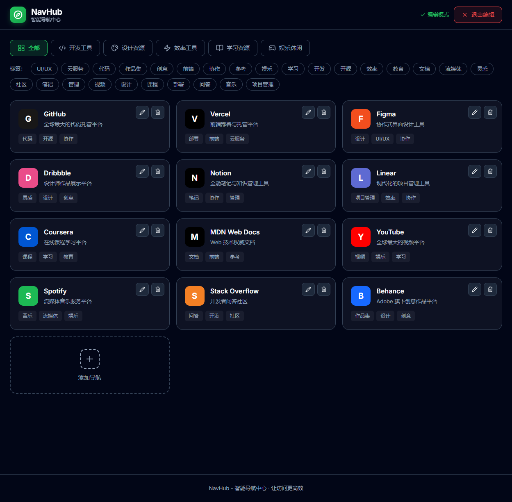
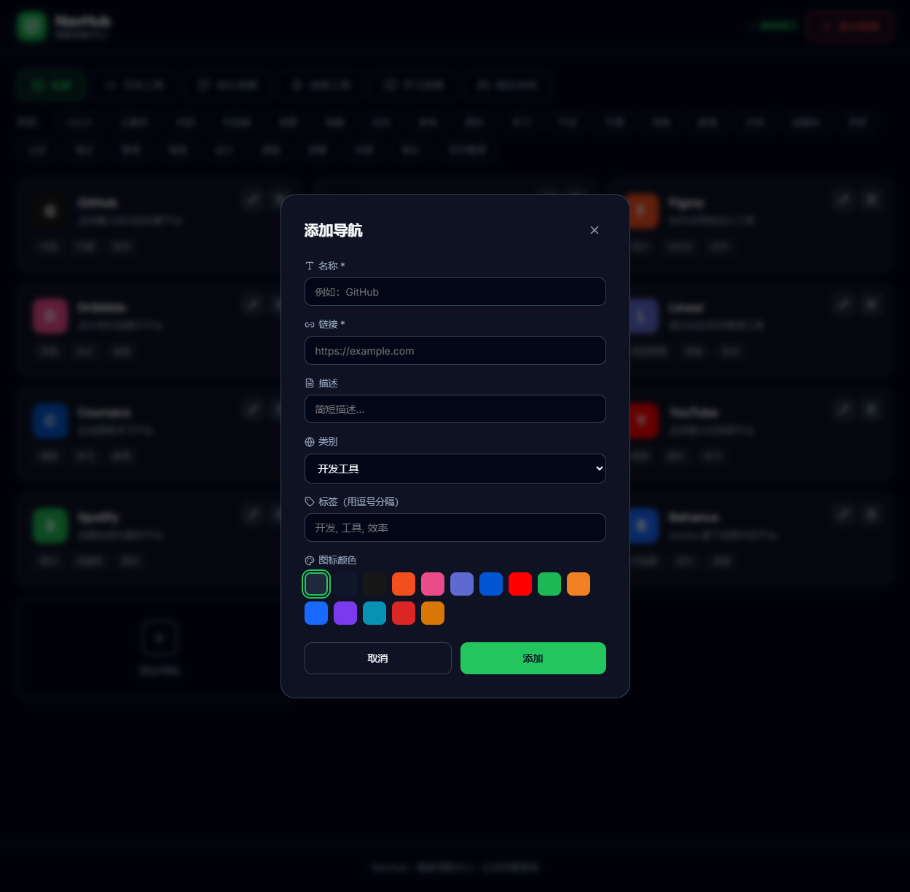
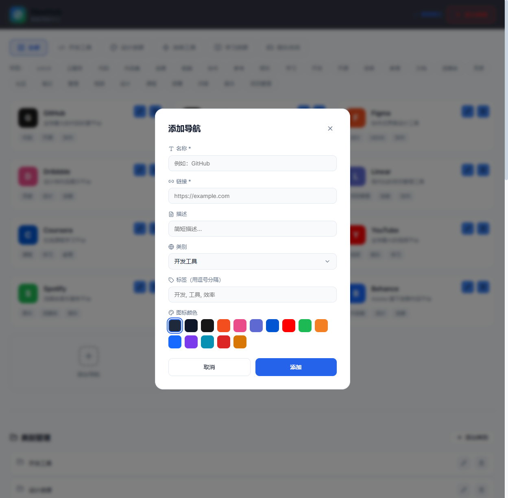
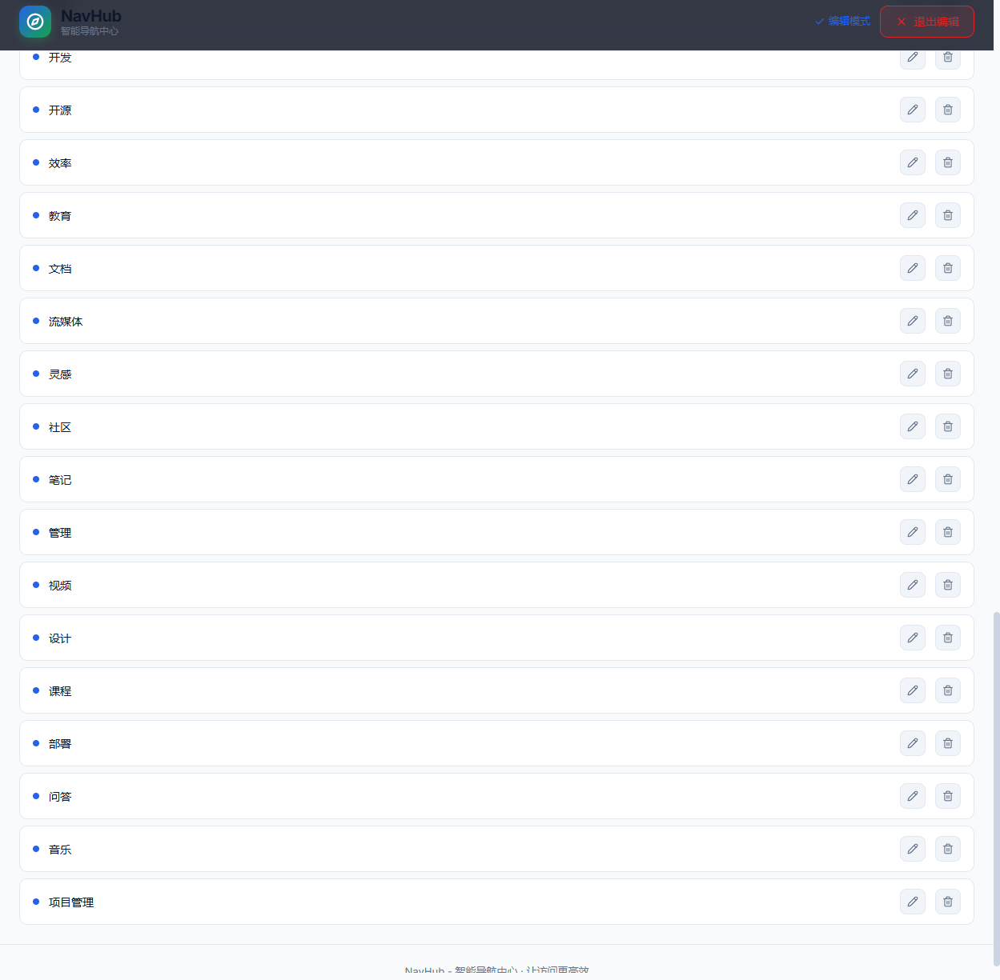

# NavHub - 智能导航中心

<p align="center">
  
</p>

<p align="center">
  <a href="https://github.com/Yikuanzz/navigation-hub/actions"></a>
  <a href="https://github.com/Yikuanzz/navigation-hub/pkgs/container/navigation-hub"></a>
  
  
</p>

一个简洁、高效的智能导航中心，支持分类浏览、标签筛选、编辑模式管理和 Docker 一键部署。

## 功能特性

- **分类导航** - 按类别组织导航链接，快速定位目标网站
- **标签筛选** - 多标签组合筛选，精准查找所需资源
- **编辑模式** - 密钥验证后进入编辑模式，支持增删改导航项
- **分类 & 标签管理** - 动态创建、编辑、删除分类和标签
- **图标自定义** - 为每个导航项选择独特的颜色标识
- **响应式设计** - 适配桌面和移动设备
- **Docker 部署** - 一键启动，数据持久化

## 界面预览

### 首页浏览

<p align="center">
  
</p>

### 编辑模式

<p align="center">
  
</p>

### 添加/编辑导航

<p align="center">
  
</p>

### 分类与标签管理

<p align="center">
  
</p>

<p align="center">
  
</p>

## 技术栈

| 层级 | 技术 |
|------|------|
| 前端 | React 19 + TypeScript + Vite |
| 后端 | Express 5 + TypeScript |
| 存储 | JSON 文件存储 |
| 容器 | Docker + Docker Compose |
| CI/CD | GitHub Actions |

## 快速开始

### 本地开发

```bash
# 克隆仓库
git clone https://github.com/Yikuanzz/navigation-hub.git
cd navigation-hub

# 安装前端依赖
npm install

# 安装后端依赖
cd server && npm install && cd ..

# 启动开发服务（同时启动前端和后端）
npm run dev
```

前端运行于 `http://localhost:5173`，后端 API 运行于 `http://localhost:3001`。

### Docker 部署

#### 方式一：Docker Compose（推荐）

```bash
# 克隆仓库
git clone https://github.com/Yikuanzz/navigation-hub.git
cd navigation-hub

# 启动服务
docker-compose up -d

# 查看日志
docker-compose logs -f
```

服务将运行在 `http://localhost:3001`，数据通过 Docker Volume 持久化。

#### 方式二：Docker 直接运行

```bash
# 从 GitHub Container Registry 拉取镜像
docker pull ghcr.io/yikuanzz/navigation-hub:latest

# 运行容器
docker run -d \
  --name navhub \
  -p 3001:3001 \
  -v navhub-data:/app/server/data \
  --restart unless-stopped \
  ghcr.io/yikuanzz/navigation-hub:latest
```

#### 方式三：本地构建 Docker 镜像

```bash
# 构建镜像
docker build -t navigation-hub .

# 运行容器
docker run -d \
  --name navhub \
  -p 3001:3001 \
  -v navhub-data:/app/server/data \
  --restart unless-stopped \
  navigation-hub
```

## CI/CD

本项目使用 GitHub Actions 实现自动化构建与发布：

| 触发条件 | 工作流 |
|----------|--------|
| `push` 到 `main` 分支 | 构建 + 测试 + 推送 Docker 镜像 |
| `push` tag `v*` | 构建 + 测试 + 推送镜像 + 创建 GitHub Release |
| Pull Request | 构建 + 测试 |

Docker 镜像发布至 [GitHub Container Registry](https://github.com/Yikuanzz/navigation-hub/pkgs/container/navigation-hub)。

```bash
# 拉取最新镜像
docker pull ghcr.io/yikuanzz/navigation-hub:latest

# 或拉取特定版本
docker pull ghcr.io/yikuanzz/navigation-hub:v1.0.0
```

## API 文档

后端提供以下 REST API：

### 导航项

| 方法 | 路径 | 描述 |
|------|------|------|
| GET | `/api/items` | 获取所有导航项 |
| POST | `/api/items` | 创建导航项 |
| PUT | `/api/items/:id` | 更新导航项 |
| DELETE | `/api/items/:id` | 删除导航项 |

### 分类

| 方法 | 路径 | 描述 |
|------|------|------|
| GET | `/api/categories` | 获取所有分类 |
| POST | `/api/categories` | 创建分类 |
| PUT | `/api/categories/:id` | 更新分类 |
| DELETE | `/api/categories/:id` | 删除分类 |

### 标签

| 方法 | 路径 | 描述 |
|------|------|------|
| GET | `/api/tags` | 获取所有标签 |
| PUT | `/api/tags/:name` | 重命名标签 |
| DELETE | `/api/tags/:name` | 删除标签 |

### 认证

| 方法 | 路径 | 描述 |
|------|------|------|
| POST | `/api/auth/verify` | 验证编辑密钥 |

## 项目结构

```
navigation-hub/
├── .github/workflows/     # GitHub Actions CI/CD
├── docs/screenshots/      # 项目截图
├── server/                # 后端服务
│   ├── src/
│   │   ├── index.ts       # 服务入口
│   │   ├── data-store.ts  # 数据存储层
│   │   └── routes/        # API 路由
│   └── data/
│       └── nav-data.json  # 数据文件
├── src/                   # 前端源码
│   ├── components/        # React 组件
│   ├── api/               # API 客户端
│   ├── App.tsx            # 应用根组件
│   └── main.tsx           # 入口文件
├── Dockerfile             # Docker 构建文件
├── docker-compose.yml     # Docker Compose 配置
├── docker-entrypoint.sh   # 容器启动脚本
├── index.html             # HTML 模板
├── package.json           # 前端依赖
├── vite.config.ts         # Vite 配置
└── tsconfig*.json         # TypeScript 配置
```

## 环境变量

| 变量 | 默认值 | 说明 |
|------|--------|------|
| `NODE_ENV` | `development` | 运行环境 |
| `PORT` | `3001` | 服务端口号 |
| `DATA_DIR` | `./server/data` | 数据文件目录 |

## License

[MIT](LICENSE)
